# Lean 4 Formalization ↔ 65 Baker-Dependent Problems

> Render in VS Code (Markdown Preview Enhanced), GitHub, or [Mermaid Live Editor](https://mermaid.live)

```mermaid
graph TD
    classDef axiom fill:#6cf,stroke:#333,stroke-width:2px,color:#000
    classDef proved fill:#6f6,stroke:#333,stroke-width:2px,color:#000
    classDef sorry fill:#f66,stroke:#333,stroke-width:2px,color:#fff
    classDef direct fill:#f96,stroke:#333,stroke-width:3px,color:#000
    classDef connected fill:#fc9,stroke:#555,stroke-width:2px,color:#000
    classDef distant fill:#ccc,stroke:#999,stroke-width:1px,color:#333

    %% ============================================
    %% LAYER 0: OUR 10 AXIOMS (Blue)
    %% ============================================
    subgraph AX["AXIOMS -- 10 published theorems accepted without proof"]
        A1["A1: baker_two_three<br/>LMN 1995, 2-log form"]
        A2["A2: rhin_irrationality<br/>mu of log2/log3 le 7.616"]
        A3["A3: hercher_no_small_cycle<br/>no m le 91 cycles"]
        A4["A4: baker_steiner<br/>no large cycles"]
        A5["A5: weyl_equidistribution<br/>Weyl 1916"]
        A6["A6: matveev_three_log<br/>Matveev 2000"]
        A7["A7: denjoy_koksma<br/>Khintchine/Herman"]
        A8["A8: skew_product_ergodic<br/>Furstenberg 1961"]
        A9["A9: arithmetic_decoupling<br/>danger density to 1/2"]
        A10["A10: matveev_general<br/>n-variable log forms"]
    end

    %% ============================================
    %% LAYER 1: KEY PROVED RESULTS (Green)
    %% ============================================
    subgraph PR["PROVED -- 15 key results, no sorry"]
        P1["distance_powers_lower_bound<br/>effective 2^a - 3^b bound"]
        P2["sunit_gap_effective<br/>S-unit gap via Baker"]
        P3["sunit_c_effective_bound<br/>cycle coefficient bound"]
        P4["cycle_c0_baker_bound<br/>cycle starting value"]
        P5["no_cycle<br/>Hercher + Baker-Steiner"]
        P6["spectral_gap_iterated<br/>x3 contraction by induction"]
        P7["hensel_attrition_exact<br/>d-step decay = 2 to the -d"]
        P8["linearFormN_23_nonzero<br/>mult independence 2,3"]
        P9["linearFormN_257_nonzero<br/>mult independence 2,5,7"]
        P10["reaches_one_of_linear_drift<br/>drift implies Collatz"]
        P11["reaches_one_of_sublinear_deficit<br/>deficit implies Collatz"]
        P12["poisson_jensen_blaschke<br/>Blaschke product bound"]
        P13["orbit_cos_prod_norm<br/>telescoping product = 1"]
        P14["metric_conflict<br/>2-adic vs 3-adic attrition"]
        P15["bit_peeling<br/>T mod 2^k from n mod 2^k+1"]
    end

    %% ============================================
    %% LAYER 2: OPEN GAPS (Red)
    %% ============================================
    subgraph SR["SORRYS -- 12 open gaps"]
        S1["nu3_linear_bound<br/>equiv Collatz"]
        S2["finite_deficit_bound<br/>equiv Collatz"]
        S3["equidist_implies_deficit_bdd<br/>equiv Collatz"]
        S4["cellSeqNu2_equidistributed<br/>equiv Collatz"]
        S5["syracuseValSum_equidist<br/>equiv Collatz"]
        S6["simultaneous_approx_257<br/>deep Diophantine"]
        S7["spectral_gap_transfer<br/>Fourier analysis"]
        S8["sunit_solutions_finite<br/>exp beats poly"]
        S9["furstenberg_partition_rigidity<br/>measure rigidity"]
        S10["spectral_gap_implies_collatz"]
        S11["spectral_gap_implies_furstenberg"]
        S12["spectral_gap_implies_littlewood"]
    end

    %% ============================================
    %% LAYER 3: 65 EXTERNAL PROBLEMS
    %% ============================================
    subgraph EF["Baker Foundations"]
        E1["#1 Baker-Wustholz<br/>refined Baker bound"]
        E2["#2 Matveev 2000<br/>3-log linear form"]
        E3["#3 LMN 1995<br/>2-log linear form"]
        E44["#44 Hermite-Lindemann<br/>foundation for Baker"]
    end

    subgraph EP["Pade and Hypergeometric"]
        E4["#4 Pade approximation"]
        E5["#5 Hypergeometric method"]
        E6["#6 Effective Pade bounds"]
    end

    subgraph ET["Transcendence and Independence"]
        E43["#43 Irrationality measures"]
        E45["#45 Linear independence of logs"]
        E46["#46 Six Exponentials Thm"]
        E47["#47 Schanuel conjecture"]
        E48["#48 Gelfond-Schneider"]
    end

    subgraph ES["S-Unit and Thue Equations"]
        E7["#7 Thue equations"]
        E8["#8 Thue-Mahler"]
        E9["#9 Superelliptic"]
        E16["#16 S-unit equations"]
    end

    subgraph EN["Norm Forms"]
        E10["#10 Norm form equations"]
        E11["#11 Skolem-Mahler-Lech"]
        E12["#12 Schmidt Subspace Thm"]
        E13["#13 Absolute norm forms"]
        E14["#14 Decomposable forms"]
        E15["#15 Index form equations"]
    end

    subgraph EI["Integral Points"]
        E17["#17 Integral points on curves"]
        E18["#18 Mordell equations"]
        E19["#19 Elliptic integral points"]
    end

    subgraph EW["Perfect Powers"]
        E20["#20 Tijdeman theorem"]
        E21["#21 Catalan / Mihailescu"]
        E22["#22 Pillai conjecture"]
        E23["#23 Rep-digit numbers"]
        E24["#24 Fibonacci powers"]
        E25["#25 Lucas powers"]
        E26["#26 Tribonacci powers"]
        E27["#27 Power sums = powers"]
        E28["#28 Poly-exponential eqns"]
        E29["#29 Powers in recurrences"]
        E30["#30 Mixed exponential eqns"]
    end

    subgraph ER["Linear Recurrences"]
        E31["#31 Recurrence zeros"]
        E32["#32 Non-degenerate recurrences"]
        E33["#33 Fibonacci divisibility"]
        E34["#34 Lucas sequences"]
        E35["#35 Recurrence mod p"]
        E36["#36 Automatic sequences"]
    end

    subgraph EC["Class Numbers"]
        E37["#37 Class number one"]
        E38["#38 Class number two"]
        E39["#39 Imaginary quadratic"]
        E40["#40 Real quadratic"]
        E41["#41 Gauss class number"]
        E42["#42 Modular forms / CM"]
    end

    subgraph EL["Elliptic Curves and Fermat"]
        E49["#49 Elliptic curve ranks"]
        E50["#50 Torsion / Mazur"]
        E51["#51 Modular elliptic curves"]
        E52["#52 Fermat Last Theorem"]
        E53["#53 BSD conjecture"]
        E54["#54 Heegner points"]
        E55["#55 Gross-Zagier formula"]
        E56["#56 Kolyvagin theorem"]
    end

    subgraph EA["Algorithms"]
        E57["#57 LLL algorithm"]
        E58["#58 Factoring algorithms"]
        E59["#59 Primality testing"]
        E60["#60 Discrete logarithm"]
        E61["#61 Lattice-based crypto"]
    end

    subgraph ED["Distance Bounds and Conjectures"]
        E62["#62 Waring problem"]
        E63["#63 2^m - 3^n bounds"]
        E64["#64 abc conjecture"]
        E65["#65 Vojta conjecture"]
    end

    %% ============================================
    %% INTERNAL EDGES: Axiom --> Proved
    %% ============================================
    A1 --> P1
    A1 --> P2
    A1 --> P3
    A1 --> P4
    A1 --> P8
    A2 --> P1
    A3 --> P5
    A4 --> P5
    A6 --> P8
    A6 --> P9
    A7 --> P11
    A9 --> P7
    A9 --> P14
    A10 --> P9

    %% ============================================
    %% INTERNAL EDGES: Axiom --> Sorry (direct)
    %% ============================================
    A5 --> S3
    A5 --> S4
    A5 --> S5
    A8 --> S9

    %% ============================================
    %% INTERNAL EDGES: Proved --> Sorry
    %% ============================================
    P10 --> S1
    P11 --> S2
    P7 --> S2
    P14 --> S2
    P15 --> S2
    P13 --> S7
    P6 --> S10
    P6 --> S11
    P6 --> S12
    P2 --> S8
    P9 --> S6
    P1 --> S6

    %% ============================================
    %% EXTERNAL --> INTERNAL: Direct formalization
    %% (thick arrows for directly formalized)
    %% ============================================
    E3 ==> A1
    E2 ==> A6
    E2 ==> A10
    E43 ==> A2
    E45 ==> P8
    E45 ==> P9
    E63 ==> P1

    %% ============================================
    %% EXTERNAL --> INTERNAL: Partial / connected
    %% (dashed arrows)
    %% ============================================
    E1 -.-> A1
    E8 -.-> P2
    E16 -.-> P2
    E16 -.-> S8
    E48 -.-> P12
    E46 -.-> P9
    E57 -.-> P1
    E20 -.-> A1
    E62 -.-> A1
    E64 -.-> A1

    %% ============================================
    %% EXTERNAL --> EXTERNAL: Dependency chains
    %% ============================================
    E44 -.-> E1
    E4 -.-> A2
    E5 -.-> A2
    E6 -.-> A2
    E47 -.-> E46
    E7 -.-> E8
    E8 -.-> E9
    E9 -.-> E16
    E12 -.-> E10
    E10 -.-> E16
    E11 -.-> E31
    E13 -.-> E10
    E14 -.-> E10
    E15 -.-> E10
    E16 -.-> E17
    E17 -.-> E18
    E18 -.-> E19
    E16 -.-> E49
    E20 -.-> E21
    E20 -.-> E22
    E20 -.-> E23
    E20 -.-> E24
    E24 -.-> E25
    E25 -.-> E26
    E20 -.-> E27
    E27 -.-> E28
    E28 -.-> E29
    E29 -.-> E30
    E31 -.-> E32
    E31 -.-> E33
    E33 -.-> E34
    E34 -.-> E35
    E35 -.-> E36
    A1 -.-> E37
    E37 -.-> E38
    E38 -.-> E39
    E39 -.-> E40
    E40 -.-> E41
    E41 -.-> E42
    E49 -.-> E50
    E50 -.-> E51
    E51 -.-> E52
    E52 -.-> E53
    E53 -.-> E54
    E54 -.-> E55
    E55 -.-> E56
    E57 -.-> E58
    E58 -.-> E59
    E59 -.-> E60
    E60 -.-> E61
    E64 -.-> E65

    %% ============================================
    %% NODE STYLING
    %% ============================================
    class A1,A2,A3,A4,A5,A6,A7,A8,A9,A10 axiom
    class P1,P2,P3,P4,P5,P6,P7,P8,P9,P10,P11,P12,P13,P14,P15 proved
    class S1,S2,S3,S4,S5,S6,S7,S8,S9,S10,S11,S12 sorry
    class E2,E3,E43,E45,E63 direct
    class E1,E7,E8,E9,E16,E20,E21,E46,E48,E57,E62,E64 connected
    class E4,E5,E6,E10,E11,E12,E13,E14,E15,E17,E18,E19 distant
    class E22,E23,E24,E25,E26,E27,E28,E29,E30 distant
    class E31,E32,E33,E34,E35,E36,E37,E38,E39,E40,E41,E42,E44,E47 distant
    class E49,E50,E51,E52,E53,E54,E55,E56,E58,E59,E60,E61,E65 distant
```

## How to Read This Map

### Color Legend

| Color | Zone | Count | Meaning |
|-------|------|-------|---------|
| Blue `#6cf` | Axioms | 10 | Published theorems accepted without proof in our Lean formalization |
| Green `#6f6` | Proved | 15 | Key theorems we proved (no sorry) |
| Red `#f66` | Sorrys | 12 | Open gaps; 5 are equivalent to Collatz |
| Orange `#f96` (thick) | Direct | 5 | External problems directly formalized in our code |
| Orange `#fc9` (thin) | Connected | 12 | External problems with partial formalization or one-hop connection |
| Grey `#ccc` | Distant | 48 | External problems reachable only through intermediary chains |

### Arrow Legend

| Arrow | Meaning |
|-------|---------|
| `==>` thick solid | Direct formalization: external result appears as axiom or proved theorem |
| `-->` solid | Internal dependency: axiom used in proof, or proved result reduces to sorry |
| `-.->` dashed | Indirect connection: strengthens, generalizes, or chains through intermediaries |

### Two Proof Paths to Collatz

**Main path (drift):**
A1 (Baker) --> P8 (linear form) --> P10 (drift implies Collatz) --> **S1** (nu3_linear_bound)

**Denjoy-Koksma path (deficit):**
A7 (DK) --> P11 (deficit implies Collatz) --> **S2** (finite_deficit_bound)
Also fed by: P7 (Hensel attrition), P14 (metric conflict), P15 (bit peeling)

**Spectral path (alternative):**
A9 (decoupling) --> P13 (orbit product) --> S7 (spectral transfer) --> P6 (iterated) --> S10/S11/S12

**Equivalence:** S1 and S2 are both equivalent to Collatz (proved in Conclusion.lean).

### Key External Dependency Chains

- **Baker foundations:** #44 Hermite-Lindemann --> #1 Baker-Wustholz --> A1 baker_two_three
- **S-unit pipeline:** #7 Thue --> #8 Thue-Mahler --> #9 Superelliptic --> #16 S-unit --> P2/S8
- **Perfect powers cascade:** #20 Tijdeman --> #21 Catalan, #22 Pillai, #24-26 Fibonacci/Lucas/Tribonacci
- **Class number chain:** A1 --> #37 Class one --> #38 Two --> ... --> #42 Modular forms
- **Elliptic curve tower:** #16 S-unit --> #49 Ranks --> #50 Torsion --> #51 Modularity --> #52 Fermat --> #53 BSD
- **Algorithm chain:** #57 LLL --> #58 Factoring --> #59 Primality --> #60 Discrete log --> #61 Lattice crypto
- **Transcendence tower:** #47 Schanuel --> #46 Six Exponentials --> P9 (mult independence 2,5,7)

## Statistics

| Category | Count | Notes |
|----------|-------|-------|
| Axioms (blue) | 10 | A1-A10, all from published literature |
| Proved (green) | 15 | Key results; full formalization has many more |
| Sorrys (red) | 12 | 5 equiv to Collatz, 1 deep Diophantine, 6 analytic/rigidity |
| External direct (orange thick) | 5 | #2, #3, #43, #45, #63 |
| External connected (orange thin) | 12 | #1, #7-9, #16, #20-21, #46, #48, #57, #62, #64 |
| External distant (grey) | 48 | Reachable through intermediary chains |
| **Total nodes** | **102** | 37 internal + 65 external |
| Total edges | ~85 | 14 axiom-proved, 4 axiom-sorry, 12 proved-sorry, 7 direct ext, 10 connected ext, ~38 chain edges |

## Lean Files by Zone

| Lean File | Axioms Used | Key Proved | Sorrys |
|-----------|-------------|------------|--------|
| BakerBound.lean | A1 | P1, P4 | -- |
| LinearFormThree.lean | A6 | P8 | -- |
| LinearFormGeneral.lean | A10 | P9 | -- |
| SUnitEquation.lean | A1 | P2, P3 | S8 |
| DistancePowers.lean | A1, A2 | P1 | -- |
| IrrationalityMeasure.lean | A2 | -- | -- |
| CycleAnalysis.lean | A3, A4 | P5 | -- |
| SublinearDrift.lean | -- | P10, P11 | -- |
| DiophantineRepeller.lean | -- | P7 | S2 |
| MetricConflict.lean | A9 | P14 | -- |
| CarryBitScrambling.lean | -- | P15 | -- |
| SpectralGap.lean | A9 | P6, P13 | S7 |
| Weyl.lean | A5 | -- | S3, S4 |
| SolenoidMixing.lean | -- | -- | S5 |
| DenjoyKoksma.lean | A7 | -- | -- |
| UniqueErgodicity.lean | A8 | -- | -- |
| ArithmeticRigidity.lean | -- | -- | S9-S12 |
| LittlewoodInduction.lean | -- | -- | S6 |
| PoissonJensen.lean | -- | P12 | -- |
| Conclusion.lean | -- | collatz_conjecture | -- |

## Rendering Tips

- **Mermaid Live Editor:** Set config `{"flowchart": {"curve": "basis"}}` for smoother lines
- **VS Code:** Install "Markdown Preview Enhanced" extension
- **GitHub:** Renders natively in `.md` files (may be slow for this diagram)
- **Export:** PNG at 1200px width for readability; PDF for print
- **LaTeX:** Convert to `tikzpicture` with `node distance=1.2cm` for paper figures
